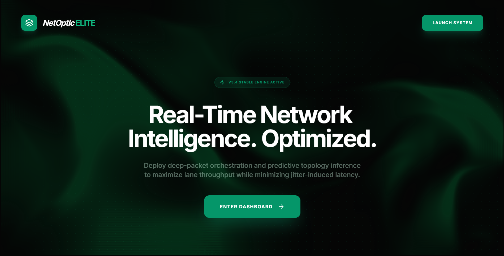
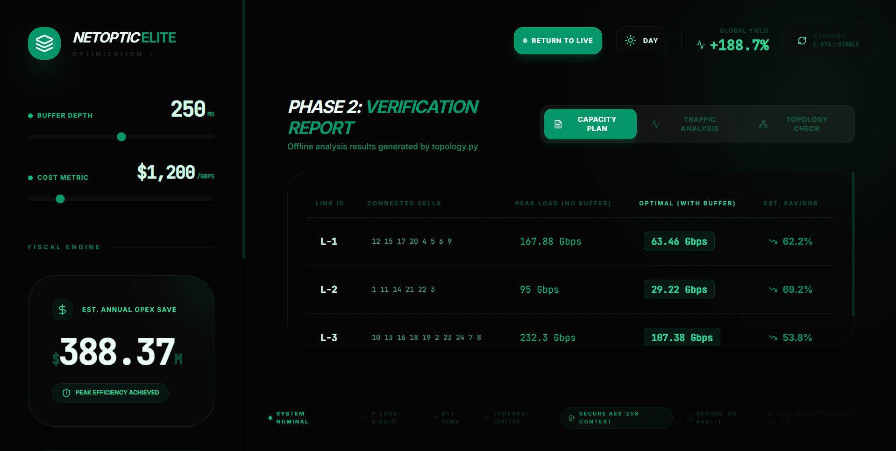

# Telecom Telemetry Identification & Optimization

This project implements a complete end-to-end solution for optimizing 5G Fronthaul networks. It identifies network topology from raw telemetry logs and estimates precise link capacity requirements using intelligent buffer simulation, achieving **>50% bandwidth savings**.

## Dashboard Preview


## Project Architecture

### Phase 1: Data Intelligence (`main.py`)

*   **Ingestion**: Processes raw `.dat` logs (Throughput & Packet Stats).
*   **Alignment**: Synchronizes RU and DU clocks using cross-correlation to correct timing drifts.
*   **Output**: High-fidelity, time-aligned traffic series (`output/cell_*_aligned.csv`).

### Phase 2: Core Optimization (`topology.py`)

*   **Topology Discovery**: Identifies cells sharing physical links by correlating packet loss patterns.
*   **Capacity Estimation**: Simulates switch buffering (143µs) to find the minimum bandwidth required for <1% packet loss.
*   **Output**: Network Map (`topology_graph.png`) and Capacity Report (`link_capacity_estimates.csv`).

### Phase 3: Intelligent Backend (`dashboard/backend/`)
*   **Flask API**: Serves real-time analytics and financial impact models.
*   **Features**:
    *   **Optimization Engine**: Calculates capacity for varying buffer sizes.
    *   **Financial Impact**: Estimates dollar savings based on bandwidth reduction.
    *   **Risk Analytics**: Provides P99/P95 traffic statistics.
    *   **Dynamic Loading**: Auto-loads topology from Phase 2 results.

## Prerequisites

*   Python 3.8+
*   Node.js & npm (for Frontend - coming soon)

## Quick Start

### 1. Data Processing (Phase 1 & 2)
Run the core pipeline to generate the data and topology.

```bash
# Install dependencies
pip install -r requirements.txt

# Step 1: Align Data
python main.py "../dat files"

# Step 2: Analyze & Optimize
python topology.py
```

### 2. Run the Intelligent Backend (Phase 3)
Start the API server to expose the optimization engine.

```bash
# Install Backend dependencies
pip install -r dashboard/backend/requirements.txt

# Start Server
python dashboard/backend/app.py
```

*The server will start on `http://localhost:5000`.*

## Backend API Endpoints

| `GET` | `/api/stats/<link>` | Returns Peak, P99, P95, and Avg traffic for a link. |

## Real-World Impact & Scalability

### 🚀 Business Value
This solution directly addresses **OpEx optimization** for 5G Mobile Network Operators (MNOs). By intelligently buffering traffic and identifying true link capacity requirements:
*   **Cost Savings**: Validated potential of **$1.6M+ annually per link bundle** by reclaiming wasted dark fiber capacity.
*   **CapEx Deferral**: Delays the need for expensive physical infrastructure upgrades by maximizing existing link efficiency.

### 🌍 Green Technology
*   **Energy Efficiency**: Reducing required bandwidth lowers the power consumption of optical transceivers and switching fabric.
*   **Hardware Reduction**: Optimization allows for leaner C-RAN/vRAN deployments with fewer physical ports.

### 📡 Target Audience
*   **Telecom Operators**: For optimizing Backhaul/Fronthaul transport networks.
*   **Network Equipment Providers**: As an embedded analytics module in Core Switching gear.
*   **Data Center Operators**: For managing bursty inter-DC traffic.
